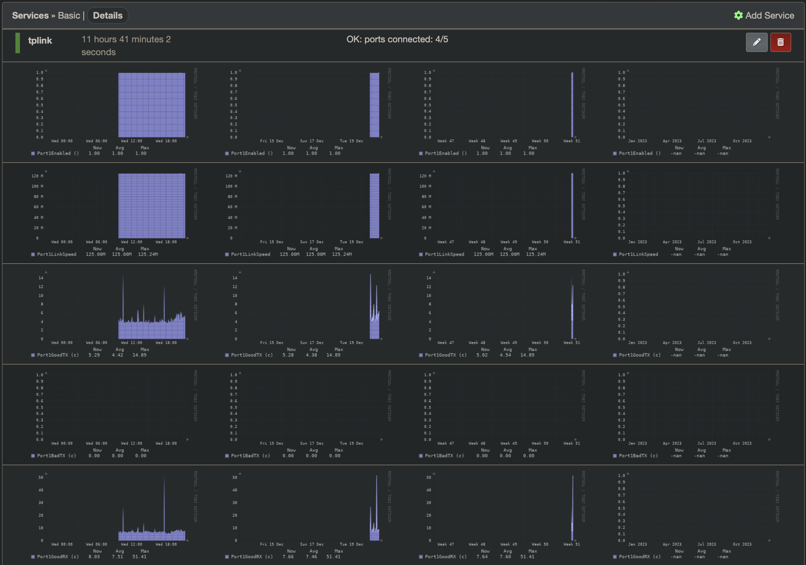
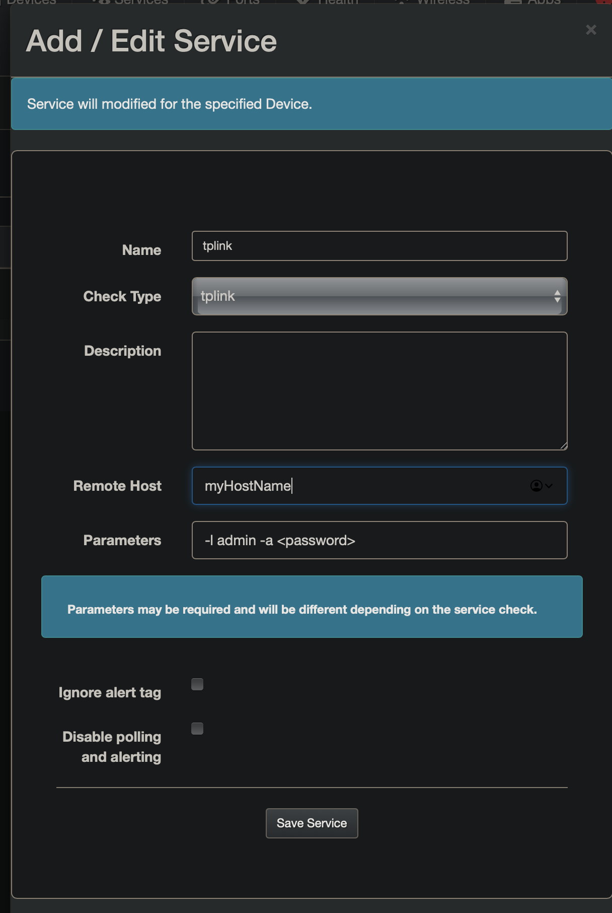

`check_tl_sg108e` is a Nagios plugin which outputs stats for TP Link "Easy Smart Manage" switches that do not support SNMP.

I personally use it with LibreNMS as a "service" on an ICMP-only host. The idea was spawned in this [LibreNMS community thread](https://community.librenms.org/t/discovering-a-switch-that-does-not-support-snmp/).

It has only been tested on TL-SG108E hardware version 3.0, firmware version 1.0.0 Build 20171214 Rel.70905.

NOTE: These TP Link switches are very insecure. Logging in to the UI will automatically cause all requests from the origin IP to be authenticated even if they do not pass cookies/session data.

# Sample Output

`OK: ports connected: 3/5 | Port1Enabled=1 Port1LinkSpeed=125000000B Port1GoodTX=1186319c Port1BadTX=0c Port1GoodRX=2576883c Port1BadRX=0c Port2Enabled=1 Port2LinkSpeed=12000000B Port2GoodTX=1067312c Port2BadTX=0c Port2GoodRX=29067c Port2BadRX=0c Port3Enabled=1 Port3LinkSpeed=125000000B Port3GoodTX=2420380c Port3BadTX=0c Port3GoodRX=287621c Port3BadRX=0c Port4Enabled=1 Port4LinkSpeed=0B Port4GoodTX=991673c Port4BadTX=0c Port4GoodRX=599551c Port4BadRX=533c Port5Enabled=1 Port5LinkSpeed=0B Port5GoodTX=0c Port5BadTX=0c Port5GoodRX=0c Port5BadRX=0c TotalGoodTX=5665684c TotalBadTX=0c TotalGoodRX=3493122c TotalBadRX=533c PortsConnected=3 TotalPorts=5`

Same output but more readable:
```
OK: ports connected: 3/5 | 
Port1Enabled=1 
Port1LinkSpeed=125000000B 
Port1GoodTX=1186319c 
Port1BadTX=0c 
Port1GoodRX=2576883c 
Port1BadRX=0c 
...
TotalGoodTX=5665684c 
TotalBadTX=0c 
TotalGoodRX=3493122c 
TotalBadRX=533c
PortsConnected=3
TotalPorts=5
```

# LibreNMS screenshots


Sample config:


# Statistics Provided

Note: `c` unit is a continuous counter for bytes as described in the [Nagios plugin documentation](https://nagios-plugins.org/doc/guidelines.html#AEN200).

|Statistic|Description|Unit|
|--|--|--|
|PortNEnabled|Whether the port is enabled|1 or 0|
|PortNGoodTX|Good transmissions on port n|c|
|PortNBadTX|Bad transmissions on port n|c|
|PortNGoodRX|Good receives on port n|c|
|PortNBadRX|Bad receives on port n|c|
|PortNLinkSpeed|Link speed in bytes/s (100Mbps half is illustrated as 50Mbps)|bytes|
|TotalGoodTX|Aggregage good transmissions across all ports|c|
|TotalBadTX|Aggregate bad transmissions across all ports|c|
|TotalGoodRX|Aggregate good receives across all ports|c|
|TotalBadRX|Aggregate good receives across all ports|c|
|PortsConnected|Number of ports connected||
|TotalPorts|Total number of ports||

# Installation
Download the proper binary from the releases page and place into the folder with the rest of your Nagios plugins. For LibreNMS users, see [this documentation](https://docs.librenms.org/Extensions/Services/).

In LibreNMS, add your TP Link switch as an ICMP-only device (disable SNMP). You can do this through the add device page; there should be a toggle to disable SNMP.

# Usage

Run `check_tl_sg108e --help` for help.

```
Usage: check_tl_sg108e [OPTIONS] --hostname <HOSTNAME>

Options:
  -H, --hostname <HOSTNAME>              TP Link switch hostname [env: HOSTNAME=]
  -u, --username <USERNAME>              Username [env: USERNAME=] [default: admin]
  -a, --authentication <AUTHENTICATION>  Authentication password [env: AUTHENTICATION=]
  -h, --help                             Print help
  -V, --version                          Print version
```

Simple usage: `check_tl_sg108e -H <hostname> -l admin -a <password>`

Usage with password as environment variable:
```bash
export AUTHENTICATION=<password>
check_tl_sg108e -H <hostname> -l admin
```

Usage with password in special `.<hostname>_password` file:
```bash
echo "<password>" > .<hostname>_password
check_tl_sg108e -H <hostname> -l admin
```